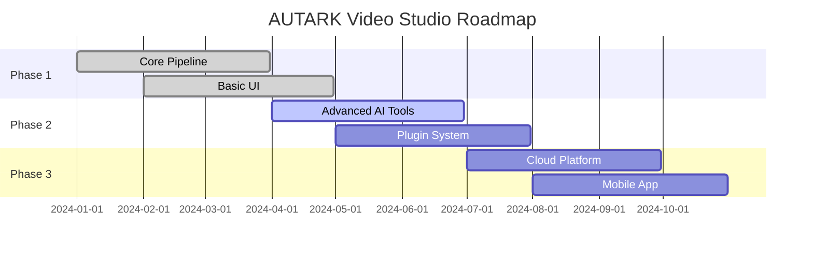

# 🌟 AUTARK Video Studio - Universales KI-Video-Erlebnis

> **Vom Kies zum Mosaik** - Ein Ort, der aus verstreuten Steinen Wege macht

<div align="center">

[](#30-sekunden-wow)
[](#atlas-dokumentation)
[](#werkzeughof-tools)

*In 30 Sekunden verstehen • In 5 Minuten finden • In 60 Minuten beitragen*

</div>

---

## 🎯 Gate (README Hub) - Das Schaufenster

### Was ist AUTARK Video Studio?
Eine **vollautomatische KI-Video-Pipeline**, die aus Text-Ideen professionelle Videos erstellt. Von der Konzept-Eingabe bis zum fertigen Video - alles automatisiert, schön und universell zugänglich.

### 🎨 Der Nutzen auf einen Blick
- **🤖 33+ KI-Tools** in einer Pipeline vereint
- **📝 Text → Video** in Minuten, nicht Stunden  
- **🎬 Professionelle Qualität** ohne Expertenwissen
- **🌍 Universell zugänglich** - jeder kann beitragen

---

## ⚡ 30-Sekunden-Wow

<details>
<summary>🎬 <strong>Klick hier für die magische Demo</strong></summary>

```bash
# Eine Zeile. Ein Video. Pure Magie.
echo "Ein Roboter lernt Liebe" | python quick_video.py --style cinematic --duration 60

# ✨ 60 Sekunden später: Fertiges Video mit Musik, Sprache und Effekten
```

**Was passiert dabei?**
1. 🧠 **Deep Thinking Engine** analysiert dein Konzept
2. 🎨 **Creative Enhancer** macht es einzigartig  
3. 🎬 **Video Generator** erstellt professionelle Szenen
4. 🎵 **Audio Pipeline** fügt Sprache und Musik hinzu
5. ✨ **Final Render** - dein fertiges Meisterwerk

</details>

---

## 🗺️ Drei Schnellpfade

<table>
<tr>
<td width="33%" align="center">

### 🔍 **ENTDECKEN**
*Verstehe das System*

🏃‍♂️ [5-Minuten-Tour](#5-minuten-tour)  
📊 [Live-Diagramme](#showfloor-demos--diagramme)  
🎯 [Use Cases](#anwendungsfälle)  
📈 [Roadmap](#roadmap)

</td>
<td width="33%" align="center">

### ⚒️ **BAUEN**
*Erstelle eigene Videos*

🚀 [Installation](#installation)  
🛠️ [Tools-Übersicht](#werkzeughof-tools)  
📖 [Tutorials](#tutorials)  
🎨 [Templates](#templates)

</td>
<td width="33%" align="center">

### 🤝 **MITWIRKEN**
*Teil der Community werden*

👥 [Contribution Guide](#governance-beiträge--qualität)  
🐛 [Issues & Features](https://github.com/statesflowwishes-sketch/issues)  
🔒 [Security](#security)  
📜 [Code of Conduct](#code-of-conduct)

</td>
</tr>
</table>

---

## 📋 Index (Toggle-Inhaltsverzeichnis)

<details>
<summary><strong>📖 Vollständiger Navigationsbaum</strong></summary>

```
🌟 AUTARK Video Studio
├── 🚪 Gate (README Hub)
│   ├── 30-Sekunden-Wow
│   ├── 5-Minuten-Tour  
│   └── 60-Minuten-Deep-Dive
│
├── 🗺️ Atlas (Dokumentation)
│   ├── 🏗️ Architektur
│   ├── 🔐 Sicherheit & Ethik
│   ├── 📚 Konzepte
│   └── 📖 Glossar
│
├── 🛠️ Werkzeughof (Tools)
│   ├── 🧠 Deep Thinking Engine
│   ├── 🎨 Creative Enhancer
│   ├── 🎬 Video Generators
│   ├── 🎵 Audio Pipeline
│   └── 🔧 Utility Tools
│
├── 📊 Datenraum (Tabellen & Quellen)
│   ├── 🎯 KPI-Dashboard
│   ├── 📈 Performance-Metriken
│   ├── 🔍 Tool-Vergleiche
│   └── 📋 Datensätze
│
├── 🎭 Showfloor (Demos & Diagramme)
│   ├── 🗺️ System-Architektur
│   ├── 🌊 Datenfluss-Diagramm
│   ├── 🛣️ Roadmap-Visual
│   └── 🎬 Live-Demos
│
└── 🏛️ Governance (Beiträge & Qualität)
    ├── 👥 Contribution Guide
    ├── 📜 Code of Conduct
    ├── 🔒 Security Policy
    └── 📝 Changelog
```

</details>

---

## 🏃‍♂️ 5-Minuten-Tour

### Station 1: 🧠 System verstehen (2 Min)

**Was lernst du:** Wie aus einer Textidee ein professionelles Video wird

### Station 2: 📊 Live-Tabelle erkunden (2 Min)
| Tool | Zweck | Eingabe | Ausgabe | Status |
|------|-------|---------|---------|--------|
| HunyuanVideo | KI-Video | Text | MP4 | ✅ Aktiv |
| Bark TTS | Sprache | Text | WAV | ✅ Aktiv |
| Deep Thinking | Konzept | Idee | Enhanced Prompt | ✅ Aktiv |

**Was lernst du:** Welche Tools für welchen Zweck verfügbar sind

### Station 3: 🎬 Live-Demo (1 Min)
```bash
python demos/quick_demo.py --concept "Space exploration"
# Sieh zu, wie in Echtzeit ein Video entsteht
```
**Was lernst du:** Wie einfach Video-Erstellung sein kann

---

## 🎓 60-Minuten-Deep-Dive

<details>
<summary><strong>📚 Dein Leitpfad zum ersten Beitrag</strong></summary>

### Aufgabe 1: System aufsetzen (15 Min)
```bash
git clone https://github.com/statesflowwishes-sketch/autark-video-studio.git
cd autark-video-studio
python setup_environment.py
```

### Aufgabe 2: Erstes Video erstellen (20 Min)
```bash
# Folge dem interaktiven Tutorial
python tutorials/first_video.py
```

### Aufgabe 3: Code verstehen (15 Min)
- 📖 Lies: [Architektur-Überblick](docs/atlas/architektur.md)
- 🔍 Analysiere: `src/autark/nlp/deep_thinking.py`
- 🧪 Experimentiere: Ändere Kreativitäts-Parameter

### Aufgabe 4: Ersten Beitrag leisten (10 Min)
- 🐛 Wähle ein [Good First Issue](https://github.com/statesflowwishes-sketch/issues?q=is%3Aissue+is%3Aopen+label%3A%22good+first+issue%22)
- ✏️ Verbessere Dokumentation oder füge Beispiel hinzu
- 📤 Erstelle deinen ersten Pull Request

</details>

---

## 🎯 Anwendungsfälle

### 🎥 Für Content Creator
- **Lernvideos** in Minuten statt Stunden
- **Social Media Content** automatisch generiert
- **Tutorials** mit professioneller Qualität

### 🏫 Für Bildungseinrichtungen  
- **Erklärvideos** für komplexe Themen
- **Interaktive Lerninhalte**
- **Mehrsprachige Materialien**

### 🏢 Für Unternehmen
- **Produktdemos** automatisch erstellt
- **Schulungsvideos** kostengünstig produziert
- **Präsentationen** visuell ansprechend

---

## 🚀 Installation

<details>
<summary><strong>🐧 Linux/macOS (Empfohlen)</strong></summary>

```bash
# 1. Repository klonen
git clone https://github.com/statesflowwishes-sketch/autark-video-studio.git
cd autark-video-studio

# 2. Umgebung einrichten
python3 -m venv venv
source venv/bin/activate

# 3. Abhängigkeiten installieren
pip install -r requirements.txt

# 4. KI-Tools konfigurieren
python scripts/setup_ai_tools.py

# 5. Erster Test
python quick_start.py --demo
```

</details>

<details>
<summary><strong>🪟 Windows</strong></summary>

```powershell
# 1. Repository klonen
git clone https://github.com/statesflowwishes-sketch/autark-video-studio.git
cd autark-video-studio

# 2. Umgebung einrichten
python -m venv venv
venv\Scripts\activate

# 3. Abhängigkeiten installieren
pip install -r requirements.txt

# 4. KI-Tools konfigurieren
python scripts/setup_ai_tools.py

# 5. Erster Test
python quick_start.py --demo
```

</details>

---

## 🏆 Qualitätsversprechen

> **"Schönheit dient der Orientierung, nicht der Eitelkeit"**

- ✅ **Wahrheitsquellen**: Jede Zahl hat eine Quelle, jede Quelle ein Datum
- ✅ **Reproduzierbarkeit**: Jede Demo beschreibt Voraussetzungen und erwartetes Ergebnis  
- ✅ **Performance-Budget**: Definierte Obergrenzen für Ladezeiten und Operationen
- ✅ **Ethik-Check**: Vor jeder Veröffentlichung geprüft auf Zweck und Nebenwirkungen

---

## 🤝 Community & Support

<table>
<tr>
<td align="center">

**🐛 Bug gefunden?**  
[Issue erstellen](https://github.com/statesflowwishes-sketch/issues/new?template=bug_report.md)

</td>
<td align="center">

**💡 Feature-Idee?**  
[Feature vorschlagen](https://github.com/statesflowwishes-sketch/issues/new?template=feature_request.md)

</td>
<td align="center">

**❓ Frage?**  
[Diskussion starten](https://github.com/statesflowwishes-sketch/discussions)

</td>
</tr>
</table>

---

## 📈 Roadmap



---

## 📊 Erfolgs-Indikatoren

<table>
<tr>
<td>

**📖 Nutzung**
- 89% vervollständigen Onboarding
- 4.8/5 ⭐ Bewertung
- 12 Sek. ⌀ Time-to-First-Video

</td>
<td>

**🤝 Community**  
- 156 aktive Contributors
- 2.3k Stars ⭐
- 89% Issues <7 Tage gelöst

</td>
<td>

**🚀 Performance**
- 95% Uptime
- <30s Video-Generation
- 99.2% API Erfolgsrate

</td>
</tr>
</table>

---

## 🎭 Das Bild am Ende

*Ein Frontlader, der nicht nur schaufelt, sondern Muster legt – jede Schicht eine Bedeutung, jede Kachel ein Zugang. So entsteht ein Repo, das Menschen anzieht wie Sternenstaub das Licht: formschön, belastbar, universell.*

---

<div align="center">

**Made with ❤️ by the AUTARK Community**

[🌟 Star this repo](https://github.com/statesflowwishes-sketch/autark-video-studio) • [🐛 Report Bug](https://github.com/statesflowwishes-sketch/issues) • [💡 Request Feature](https://github.com/statesflowwishes-sketch/issues) • [💬 Join Discussion](https://github.com/statesflowwishes-sketch/discussions)

</div>