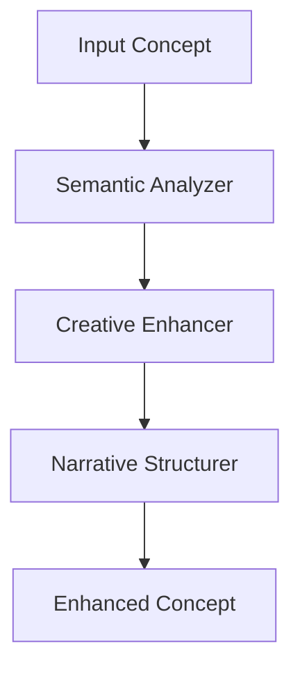
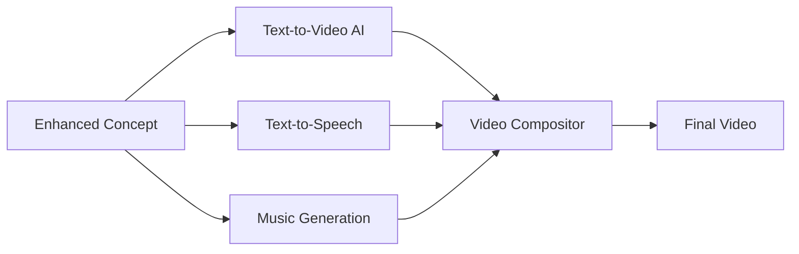
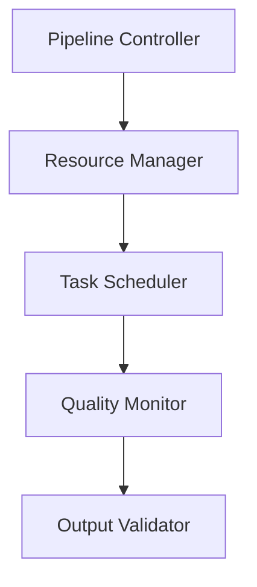
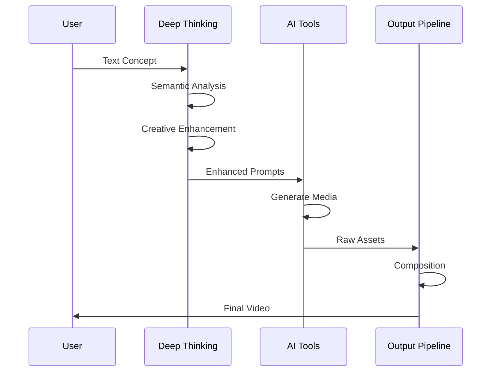
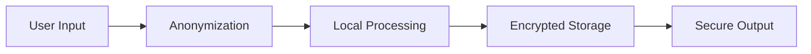
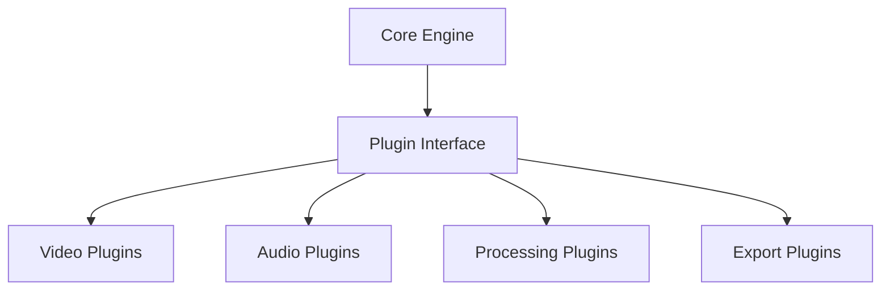

# 🏗️ Architektur - AUTARK Video Studio

> **Systemdesign für universelle KI-Video-Erstellung**

## 🎯 Architektur-Philosophie

### Prinzipien
- **Modularität**: Jedes Tool ist austauschbar
- **Skalierbarkeit**: Von Hobby bis Enterprise
- **Universalität**: Alle Sprachen, Plattformen, Stile
- **Ethik First**: Transparenz und Verantwortung

---

## 🧩 System-Komponenten

### 1. 🧠 Deep Thinking Layer


**Zweck**: Transformiert einfache Ideen in reichhaltige, strukturierte Konzepte

**Komponenten**:
- `SemanticAnalyzer`: Versteht Bedeutung und Kontext
- `CreativeEnhancer`: Fügt künstlerische Elemente hinzu
- `NarrativeStructurer`: Erstellt dramaturgische Struktur

### 2. 🎨 Content Generation Layer


**Zweck**: Generiert alle Medienkomponenten

**AI-Tools Integration**:
- **Video**: HunyuanVideo, Stable Video Diffusion
- **Audio**: Bark TTS, Coqui TTS
- **Music**: MusicGen, AudioCraft
- **Komposition**: MoviePy, Remotion

### 3. 🔧 Orchestration Layer


**Zweck**: Koordiniert alle Prozesse und Ressourcen

**Features**:
- Automatische Ressourcen-Allokation
- Fehlerbehandlung und Retry-Logik
- Qualitätskontrolle
- Performance-Monitoring

---

## 🗂️ Datenfluss-Architektur

### Eingabe → Verarbeitung → Ausgabe


### Datenstrukturen
```python
@dataclass
class VideoProject:
    concept: str
    style: str
    duration: float
    assets: List[MediaAsset]
    metadata: ProjectMetadata
    
@dataclass
class MediaAsset:
    type: MediaType  # VIDEO, AUDIO, IMAGE
    content: bytes
    timestamp: float
    properties: Dict[str, Any]
```

---

## 🔐 Sicherheits-Architektur

### Sicherheitsebenen
1. **Input Validation**: Alle Eingaben werden validiert
2. **AI Safety**: Ethik-Filter für generierte Inhalte
3. **Resource Limits**: CPU/GPU/Memory Limits
4. **Output Scanning**: Finaler Content-Check

### Datenschutz-by-Design


---

## ⚡ Performance-Architektur

### Optimierungsstrategien
- **Lazy Loading**: Nur benötigte AI-Modelle laden
- **Caching**: Intelligentes Zwischenspeichern
- **Parallel Processing**: Multi-GPU/CPU Nutzung
- **Progressive Enhancement**: Schrittweise Qualitätssteigerung

### Resource Management
```python
class ResourceManager:
    def allocate_gpu(self, task_type: str) -> GPUResource:
        """Intelligente GPU-Allokation basierend auf Task"""
        
    def schedule_tasks(self, pipeline: Pipeline) -> Schedule:
        """Optimale Task-Reihenfolge für Performance"""
```

---

## 🔌 Plugin-Architektur

### Erweiterbarkeit


### Plugin-Entwicklung
```python
class VideoPlugin(BasePlugin):
    def process(self, input_data: Any) -> VideoAsset:
        """Plugin-spezifische Logik"""
        
    def validate(self) -> bool:
        """Plugin-Validierung"""
```

---

## 📊 Monitoring & Analytics

### Metriken
- **Performance**: Rendering-Zeit, GPU-Auslastung
- **Qualität**: User-Bewertungen, Fehlerrate
- **Nutzung**: Beliebte Features, Conversion-Rate

### Observability
```python
class MetricsCollector:
    def track_performance(self, operation: str, duration: float):
        """Performance-Tracking"""
        
    def track_quality(self, output: VideoAsset, rating: float):
        """Qualitäts-Tracking"""
```

---

## 🚀 Deployment-Architektur

### Umgebungen
- **Local**: Entwicklung und Testing
- **Cloud**: Skalierbare Produktion
- **Edge**: Offline-Capabilities

### Container-Strategie
```dockerfile
# Multi-Stage Build für optimale Images
FROM nvidia/cuda:11.8-runtime-ubuntu20.04 as base
FROM base as ai-tools
FROM ai-tools as production
```

---

## 🔄 Evolution & Migration

### Versionierung
- **Semantic Versioning**: MAJOR.MINOR.PATCH
- **Backward Compatibility**: Mindestens 2 Versionen
- **Migration Guides**: Für Breaking Changes

### Future-Proofing
- **API Versioning**: Stabile Schnittstellen
- **Plugin Compatibility**: Forward/Backward Support
- **Data Format Evolution**: Migrations-Scripts

---

## 📈 Nächste Schritte

1. **📖 Detailierte Komponenten**: [Deep Thinking Engine](deep-thinking.md)
2. **🔧 Plugin Development**: [Plugin Guide](../tools/plugin-development.md)
3. **🚀 Deployment**: [Installation Guide](../tools/installation.md)
4. **🔐 Security**: [Sicherheits-Leitlinien](sicherheit.md)

---

*Architektur, die wächst wie ein Baum - stabil im Kern, flexibel in den Ästen.*