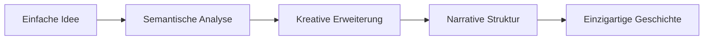
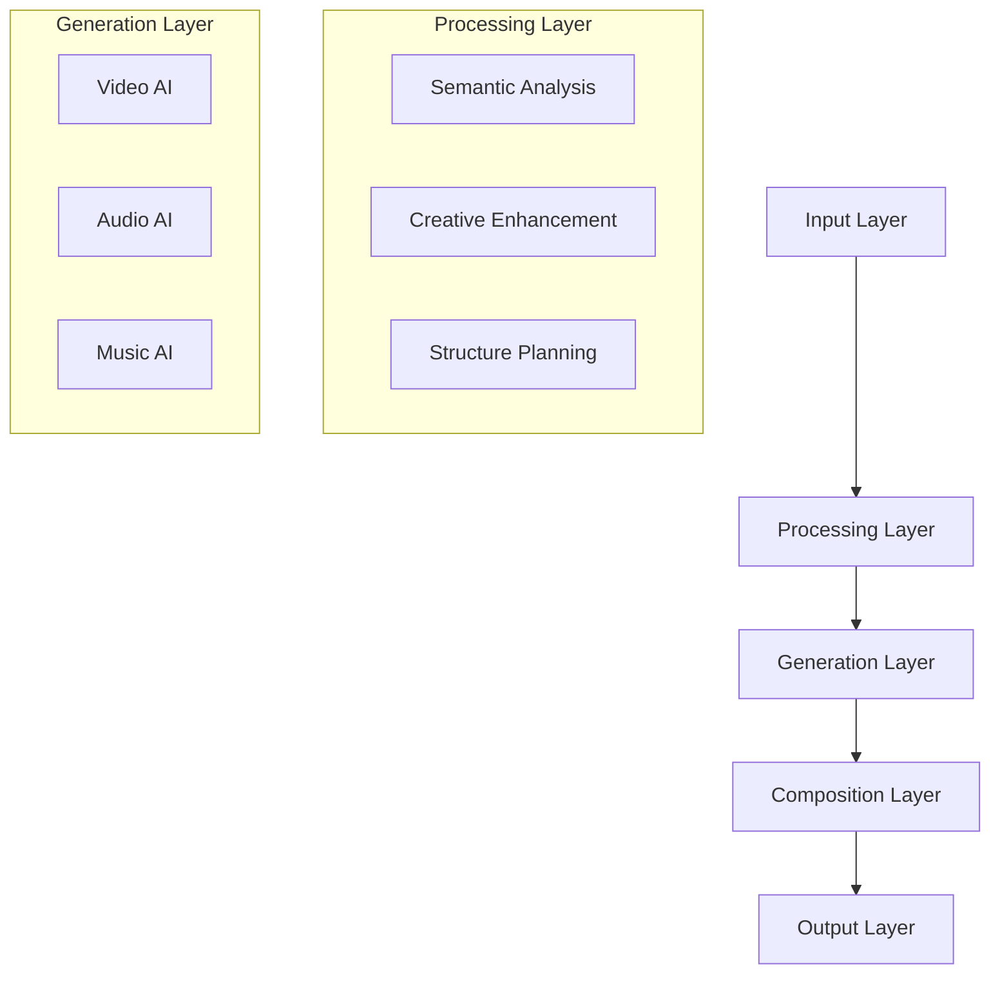
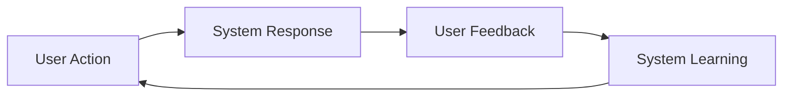

# 📚 Konzepte - AUTARK Video Studio

> **Grundlegende Ideen und Philosophien hinter dem System**

## 🧠 Kernkonzepte

### 1. Deep Thinking
**Was ist es?**
Ein KI-System, das nicht nur Prompts verarbeitet, sondern sie semantisch analysiert, kreativ erweitert und strukturiert.

**Warum wichtig?**
- Einfache Texteingaben werden zu reichhaltigen, einzigartigen Konzepten
- Jedes Video wird automatisch einzigartig und interessant
- Nutzer müssen keine Prompt-Engineering-Experten sein

**Wie funktioniert es?**


### 2. Universal Repository Experience
**Was ist es?**
Ein Dokumentations- und Navigationssystem nach dem Prinzip "Vom Kies zum Mosaik".

**Warum wichtig?**
- In 30 Sekunden verstehen
- In 5 Minuten finden
- In 60 Minuten beitragen

**Die 7 Ebenen:**
1. **Gate**: Schaufenster und Einstieg
2. **Index**: Navigierbare Inhaltsübersicht
3. **Atlas**: Konzepte und Architektur
4. **Werkzeughof**: Tools und deren Verwendung
5. **Datenraum**: Tabellen und Quellen
6. **Showfloor**: Demos und Diagramme
7. **Governance**: Beiträge und Qualität

### 3. Modulare AI-Pipeline
**Was ist es?**
33+ KI-Tools in einer koordinierten Pipeline, wo jedes Tool austauschbar ist.

**Warum wichtig?**
- Beste verfügbare Tools für jeden Zweck
- Einfache Erweiterung und Updates
- Keine Vendor-Lock-ins

**Architektur:**


---

## 🎨 Design-Philosophie

### Schönheit dient der Orientierung
- **Ästhetik mit Zweck**: Jedes visuelle Element hilft beim Verstehen
- **Reduzierte Komplexität**: Weniger ist mehr, aber nicht weniger mächtig
- **Universelle Zugänglichkeit**: Funktioniert für alle Menschen

### Vom Kies zum Mosaik
- **Verstreute Informationen**: Einzelne Tools und Konzepte
- **Klare Wege**: Logische Navigation und Struktur
- **Schönes Ganzes**: Ein kohärentes, verständliches System

---

## 🚀 Performance-Konzepte

### Progressive Enhancement
**Grundidee**: System funktioniert auf Basic-Level, wird aber mit besserer Hardware besser.

**Stufen:**
1. **Basic**: CPU-only, einfache Qualität
2. **Enhanced**: GPU-Beschleunigung, bessere Qualität
3. **Professional**: Multi-GPU, höchste Qualität
4. **Enterprise**: Cloud-Skalierung, Batch-Processing

### Lazy Loading
**Grundidee**: Nur laden, was gerade benötigt wird.

**Vorteile:**
- Schneller Start
- Geringerer Speicherverbrauch
- Bessere Skalierbarkeit

```python
class LazyAIModel:
    def __init__(self, model_path: str):
        self.model_path = model_path
        self._model = None
    
    @property
    def model(self):
        if self._model is None:
            self._model = load_model(self.model_path)
        return self._model
```

### Caching-Strategien
**Grundidee**: Intelligentes Zwischenspeichern häufig verwendeter Ergebnisse.

**Ebenen:**
- **Memory Cache**: Für aktuelle Session
- **Disk Cache**: Für wiederholte Nutzung
- **Shared Cache**: Für Community-Benefits

---

## 🎭 User Experience Konzepte

### 30-5-60 Prinzip
- **30 Sekunden**: System verstehen
- **5 Minuten**: Erstes Werkzeug finden und nutzen
- **60 Minuten**: Ersten eigenen Beitrag leisten

### Drei Schnellpfade
1. **Entdecken**: Für Neugierige und Lernende
2. **Bauen**: Für praktische Anwender
3. **Mitwirken**: Für Community-Mitglieder

### Feedback-Loops
**Grundidee**: Kontinuierliche Verbesserung durch Nutzerfeedback.



---

## 🔄 Evolutionäre Konzepte

### Living Documentation
**Grundidee**: Dokumentation, die mit dem Code mitentwickelt wird.

**Mechanismen:**
- Automatische Updates aus Code-Kommentaren
- Community-Beiträge und -Korrekturen
- Versioning und Change-Tracking

### Plugin-Ökosystem
**Grundidee**: Erweiterbarkeit ohne Kern-Änderungen.

**Prinzipien:**
- **Stable Core**: Kern bleibt stabil
- **Flexible Periphery**: Plugins können sich schnell entwickeln
- **Standard Interfaces**: Einheitliche Schnittstellen

### Community-Driven Development
**Grundidee**: Community als Co-Entwickler, nicht nur Nutzer.

**Mechanismen:**
- **Good First Issues**: Einfache Einstiegsmöglichkeiten
- **Feature Voting**: Community entscheidet über Prioritäten
- **Mentoring**: Erfahrene helfen Anfängern

---

## 🎯 Qualitäts-Konzepte

### Truth Sources
**Grundidee**: Jede Information hat eine verifizierbare Quelle.

**Umsetzung:**
- Quellen-Links in allen Zahlen und Fakten
- Datums-Stempel für Aktualität
- Automatische Veraltung-Checks

### Reproducibility
**Grundidee**: Jedes Ergebnis muss reproduzierbar sein.

**Mechanismen:**
- Seed-basierte Zufälligkeit
- Vollständige Environments
- Step-by-Step Dokumentation

### Performance Budgets
**Grundidee**: Definierte Grenzen für Performance.

**Metriken:**
- **Startup Time**: <10 Sekunden
- **First Video**: <30 Sekunden
- **Memory Usage**: <4GB RAM
- **GPU Memory**: <8GB VRAM

---

## 🔐 Sicherheits-Konzepte

### Security by Design
**Grundidee**: Sicherheit von Anfang an mitgedacht.

**Prinzipien:**
- **Least Privilege**: Minimale Berechtigungen
- **Defense in Depth**: Mehrschichtige Sicherheit
- **Fail Secure**: Sicher versagen

### Privacy by Design
**Grundidee**: Datenschutz als Standard-Einstellung.

**Umsetzung:**
- **Data Minimization**: Nur nötige Daten sammeln
- **Purpose Limitation**: Nur für angegebenen Zweck
- **Local Processing**: Verarbeitung lokal wo möglich

### Ethical AI
**Grundidee**: KI-Systeme müssen ethischen Standards folgen.

**Komponenten:**
- **Bias Detection**: Automatische Vorurteilserkennung
- **Harm Prevention**: Schadensvermeidung
- **Transparency**: Nachvollziehbare Entscheidungen

---

## 📈 Nächste Schritte

1. **🏗️ Architektur verstehen**: [System-Architektur](architektur.md)
2. **🔐 Sicherheit lernen**: [Sicherheits-Leitlinien](sicherheit.md)
3. **📖 Begriffe nachschlagen**: [Glossar](glossar.md)
4. **🛠️ Tools erkunden**: [Werkzeughof](../tools/README.md)

---

*Konzepte sind wie Samen - einfach zu pflanzen, aber sie wachsen zu mächtigen Bäumen.*