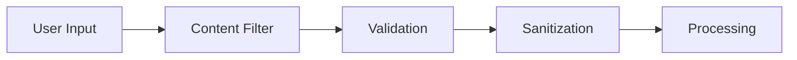
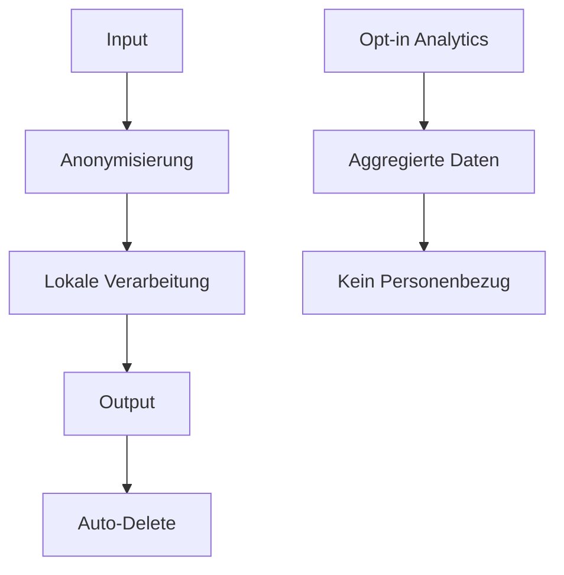

# 🔐 Sicherheit & Ethik - AUTARK Video Studio

> **Verantwortungsvolle KI-Video-Erstellung**

## 🎯 Ethik-Leitbild

### Grundsätze
- **Transparenz**: Jeder Nutzer weiß, wie KI verwendet wird
- **Kontrolle**: Menschen behalten die finale Entscheidung
- **Verantwortung**: Wir übernehmen Verantwortung für unsere Tools
- **Inklusion**: Zugänglich für alle Menschen

---

## 🔒 Sicherheits-Framework

### 1. Input-Sicherheit


**Schutzmaßnahmen**:
- Harmful Content Detection
- PII (Personally Identifiable Information) Filtering
- Copyright-Prüfung
- Spam/Abuse Protection

### 2. AI-Safety
```python
class EthicsFilter:
    def validate_content(self, content: str) -> ValidationResult:
        """Überprüft Inhalte auf ethische Probleme"""
        
        checks = [
            self.check_harmful_content(content),
            self.check_bias(content),
            self.check_misinformation(content),
            self.check_copyright(content)
        ]
        
        return ValidationResult(
            passed=all(check.passed for check in checks),
            issues=[check for check in checks if not check.passed]
        )
```

### 3. Output-Kontrolle
- **Quality Gates**: Automatische Qualitätsprüfung
- **Human Review**: Option für manuelle Überprüfung
- **Watermarking**: KI-generierte Inhalte markieren
- **Provenance Tracking**: Nachverfolgung der Entstehung

---

## 🛡️ Datenschutz-Garantien

### Privacy-by-Design Prinzipien

1. **Datenminimierung**
   - Nur notwendige Daten sammeln
   - Automatisches Löschen nach Verarbeitung
   - Lokale Verarbeitung wo möglich

2. **Zweckbindung**
   - Daten nur für angegebenen Zweck nutzen
   - Keine Weiterverwendung ohne Zustimmung
   - Transparente Datennutzung

3. **Speicherbegrenzung**
   - Automatisches Löschen nach 30 Tagen
   - Nutzer kann jederzeit Löschung veranlassen
   - Sichere Löschung (Überschreibung)

### Datenverarbeitung


---

## ⚖️ Ethik-Richtlinien

### Verbotene Inhalte
- **Hassrede**: Diskriminierung jeder Art
- **Gewalt**: Explizite Gewaltdarstellungen
- **Desinformation**: Bewusst falsche Informationen
- **Urheberrechtsverletzungen**: Nicht lizenzierte Inhalte
- **Persönlichkeitsrechtsverletzungen**: Ohne Zustimmung

### Problematische Bereiche
- **Deepfakes**: Nur mit expliziter Kennzeichnung
- **Politische Inhalte**: Besondere Vorsicht bei Wahlen
- **Kinder**: Verstärkter Schutz minderjähriger Personen
- **Sensible Themen**: Gesundheit, Finanzen, Recht

### Ethik-Check Prozess
```python
@dataclass
class EthicsAssessment:
    purpose: str  # Zweck des Videos
    potential_harm: List[str]  # Mögliche Schäden
    mitigation: List[str]  # Schutzmaßnahmen
    stakeholders: List[str]  # Betroffene Gruppen
    
class EthicsReview:
    def assess(self, project: VideoProject) -> EthicsAssessment:
        """Ethik-Bewertung vor Verarbeitung"""
        
    def monitor(self, output: VideoAsset) -> RiskLevel:
        """Kontinuierliche Überwachung"""
```

---

## 🔍 Transparenz-Maßnahmen

### AI-Kennzeichnung
- **Wasserzeichen**: Sichtbare Markierung in Videos
- **Metadaten**: Technische Informationen über Erstellung
- **Disclosure**: Klare Angabe der verwendeten AI-Tools

### Nachvollziehbarkeit
```json
{
  "video_id": "autark_20240828_001",
  "creation_date": "2024-08-28T10:30:00Z",
  "ai_tools_used": ["HunyuanVideo", "Bark TTS", "Deep Thinking Engine"],
  "processing_time": "120 seconds",
  "human_review": false,
  "content_rating": "safe",
  "ethical_review": {
    "reviewer": "system",
    "score": 0.95,
    "concerns": []
  }
}
```

---

## 🚨 Incident Response

### Meldeverfahren
1. **Sofortmeldung**: Sicherheitslücken binnen 24h
2. **Untersuchung**: Vollständige Analyse binnen 7 Tagen
3. **Behebung**: Patches binnen 48h nach Bestätigung
4. **Kommunikation**: Transparente Updates an Community

### Eskalationsstufen
- **Level 1**: Technische Probleme → Entwicklerteam
- **Level 2**: Sicherheitsprobleme → Security Team
- **Level 3**: Ethik-Probleme → Ethik-Kommission
- **Level 4**: Rechtliche Probleme → Rechtsabteilung

---

## 🎓 Verantwortliche KI-Nutzung

### Bildungsressourcen
- **AI Literacy**: Wie funktionieren KI-Systeme?
- **Best Practices**: Empfehlungen für verantwortliche Nutzung
- **Case Studies**: Beispiele für ethische Dilemmata
- **Community Guidelines**: Klare Verhaltensregeln

### Nutzer-Empowerment
```python
class UserControls:
    def set_content_filters(self, filters: List[FilterType]):
        """Nutzer definiert eigene Content-Filter"""
        
    def request_human_review(self, video_id: str):
        """Manuelle Überprüfung anfordern"""
        
    def report_concern(self, video_id: str, concern: str):
        """Bedenken melden"""
```

---

## 📊 Compliance & Standards

### Gesetzliche Anforderungen
- **DSGVO/GDPR**: Europäischer Datenschutz
- **AI Act**: EU-Gesetzgebung für KI
- **COPPA**: Schutz von Kindern (USA)
- **Lokale Gesetze**: Anpassung an Rechtssprechung

### Zertifizierungen
- **ISO 27001**: Informationssicherheit
- **SOC 2**: Sicherheit und Verfügbarkeit
- **Privacy Shield**: Datenschutz-Zertifizierung

---

## 🔄 Kontinuierliche Verbesserung

### Monitoring & Metriken
- **Bias Detection**: Automatische Vorurteilserkennung
- **Safety Metrics**: Sicherheitskennzahlen
- **User Feedback**: Community-Rückmeldungen
- **External Audits**: Unabhängige Überprüfungen

### Anpassung & Evolution
```python
class EthicsEvolution:
    def update_guidelines(self, new_insights: List[Insight]):
        """Richtlinien basierend auf neuen Erkenntnissen anpassen"""
        
    def incorporate_feedback(self, feedback: CommunityFeedback):
        """Community-Feedback in Richtlinien einarbeiten"""
```

---

## 📞 Kontakt & Meldungen

### Sicherheitskontakte
- **Security Team**: security@autark-video.studio
- **Ethik-Komitee**: ethics@autark-video.studio
- **Datenschutz**: privacy@autark-video.studio
- **Compliance**: compliance@autark-video.studio

### Whistleblower-Schutz
- Anonyme Meldungen möglich
- Schutz vor Vergeltungsmaßnahmen
- Sichere Kommunikationskanäle

---

## 📈 Nächste Schritte

1. **📖 Community Guidelines**: [Verhaltenskodex](code-of-conduct.md)
2. **🔧 Sicherheits-Tools**: [Security Tools](../tools/security-tools.md)
3. **📊 Compliance**: [Compliance Guide](compliance.md)
4. **🎓 Training**: [AI Ethics Training](ethics-training.md)

---

*Sicherheit und Ethik sind keine Zusatzfunktionen, sondern das Fundament vertrauensvoller KI.*