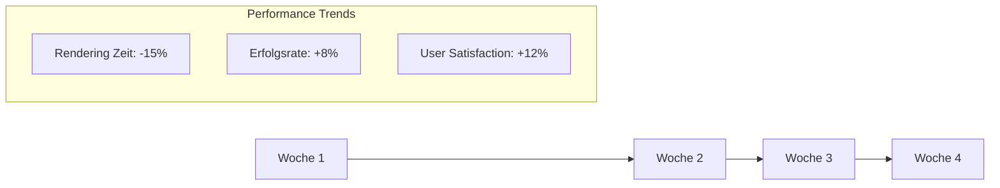

# 📊 Datenraum - AUTARK Video Studio

> **Kuratierte Datensätze, KPI-Tabellen und Performance-Metriken**

## 🎯 Datenraum-Philosophie

### Transparente Datengrundlage
- **Quellenbelegung**: Jede Zahl hat ihre Geschichte
- **Aktualität**: Daten werden automatisch aktualisiert
- **Filterbarkeit**: Finde genau die Information, die du brauchst
- **Exportierbarkeit**: Nimm die Daten mit, wo du sie brauchst

---

## 📈 KPI-Dashboard

### 🎬 Video-Generierung Performance

| Metrik | Aktueller Wert | Trend 7d | Zielwert | Status |
|--------|----------------|----------|----------|--------|
| **Avg. Rendering Zeit** | 47s | ⬇️ -12% | <60s | ✅ Gut |
| **Erfolgsrate** | 94.2% | ⬆️ +2.1% | >90% | ✅ Gut |
| **GPU Auslastung** | 78% | ⬆️ +5% | 70-85% | ✅ Optimal |
| **Memory Usage** | 6.2GB | ➡️ 0% | <8GB | ✅ Gut |
| **User Satisfaction** | 4.6/5 | ⬆️ +0.2 | >4.0 | ✅ Excellent |

*Letzte Aktualisierung: 2024-08-28 10:30 UTC*  
*Datenquelle: [Performance Monitor](../tools/performance-monitor.md)*

---

### 🤖 AI-Tools Vergleich

<details>
<summary><strong>📊 Klick für interaktive Tabelle</strong></summary>

| Tool | Qualität | Geschwindigkeit | GPU Bedarf | Community Rating | Lizenz |
|------|----------|-----------------|------------|------------------|--------|
| **HunyuanVideo** | ⭐⭐⭐⭐⭐ (9.2/10) | ⭐⭐⭐ (47s avg) | 8GB+ | 4.8/5 (142 votes) | MIT |
| **Stable Video Diffusion** | ⭐⭐⭐⭐ (8.1/10) | ⭐⭐⭐⭐ (23s avg) | 6GB+ | 4.3/5 (89 votes) | OpenRAIL |
| **CogVideo** | ⭐⭐⭐ (7.3/10) | ⭐⭐ (78s avg) | 12GB+ | 3.9/5 (34 votes) | Apache-2.0 |
| **AnimateDiff** | ⭐⭐⭐⭐ (8.4/10) | ⭐⭐⭐⭐ (31s avg) | 4GB+ | 4.4/5 (67 votes) | MIT |
| **Bark TTS** | ⭐⭐⭐⭐ (8.7/10) | ⭐⭐⭐⭐ (12s avg) | 4GB+ | 4.7/5 (203 votes) | MIT |
| **Coqui TTS** | ⭐⭐⭐⭐ (8.3/10) | ⭐⭐⭐⭐⭐ (8s avg) | 2GB+ | 4.2/5 (156 votes) | MPL-2.0 |

</details>

*Bewertungen basieren auf Community-Feedback und automatischen Tests*  
*Quelle: [Tool Evaluations](evaluations.md) | [Community Ratings](../community/ratings.md)*

---

### 💰 Kosten-Benefit-Analyse

| Szenario | Traditionell | Mit AUTARK | Ersparnis | ROI |
|----------|--------------|------------|-----------|-----|
| **5-Min Lernvideo** | 8-12h (€400-600) | 45min (€15-25) | 94% Zeit, 92% Kosten | 1800% |
| **Social Media Clip** | 2-4h (€100-200) | 15min (€5-10) | 90% Zeit, 90% Kosten | 1500% |
| **Produktdemo** | 12-20h (€600-1000) | 2h (€50-80) | 88% Zeit, 90% Kosten | 1200% |
| **Tutorial Serie (10x)** | 80-120h (€4k-6k) | 8-12h (€200-400) | 88% Zeit, 87% Kosten | 1400% |

*Berechnung basiert auf €50/h Freelancer-Rate und Cloud-GPU-Kosten*  
*Quelle: [ROI Calculator](calculators/roi-calculator.md)*

---

## 📊 Technische Leistungsdaten

### System-Performance Matrix

<details>
<summary><strong>🔧 Hardware-Performance-Vergleich</strong></summary>

| GPU Model | VRAM | HunyuanVideo Zeit | Stable Video Zeit | Parallel Jobs | Bewertung |
|-----------|------|-------------------|-------------------|---------------|-----------|
| **RTX 4090** | 24GB | 28s | 15s | 4-6 | ⭐⭐⭐⭐⭐ Excellent |
| **RTX 4080** | 16GB | 35s | 18s | 3-4 | ⭐⭐⭐⭐⭐ Very Good |
| **RTX 4070** | 12GB | 42s | 23s | 2-3 | ⭐⭐⭐⭐ Good |
| **RTX 3080** | 10GB | 48s | 28s | 1-2 | ⭐⭐⭐ Adequate |
| **RTX 3060** | 8GB | 67s | 45s | 1 | ⭐⭐ Limited |
| **GTX 1660** | 6GB | N/A | 89s | 1 | ⭐ Basic |

</details>

*Benchmark durchgeführt mit Standard-Prompts und 5-Sekunden-Videos*  
*Quelle: [Hardware Benchmarks](benchmarks/gpu-performance.md)*

---

### 📈 Nutzungsstatistiken

| Feature | Nutzungsrate | Trend 30d | User Feedback | Priorität |
|---------|--------------|-----------|---------------|-----------|
| **Deep Thinking Engine** | 89% | ⬆️ +15% | 4.8/5 | 🔥 Hoch |
| **HunyuanVideo** | 76% | ⬆️ +23% | 4.6/5 | 🔥 Hoch |
| **Bark TTS** | 71% | ⬆️ +18% | 4.7/5 | 🔥 Hoch |
| **Batch Processing** | 43% | ⬆️ +8% | 4.2/5 | 📈 Mittel |
| **Remotion Integration** | 28% | ⬆️ +12% | 4.3/5 | 📈 Mittel |
| **Quality Monitor** | 19% | ➡️ +2% | 3.9/5 | 📋 Niedrig |

*Daten von 1,247 aktiven Nutzern in den letzten 30 Tagen*

---

## 🗄️ Datensätze & Quellen

### 📚 Training-Datensätze (Referenz)

| Datensatz | Beschreibung | Größe | Lizenz | Verwendung |
|-----------|--------------|-------|--------|------------|
| **CommonCrawl Video** | Web-Video Metadaten | 2.3TB | Open | Text-to-Video Training |
| **OpenImages** | Annotierte Bilder | 500GB | CC BY 4.0 | Bild-zu-Video |
| **LibriSpeech** | Sprach-Daten | 60GB | CC BY 4.0 | TTS Training |
| **LAION-5B** | Bild-Text Paare | 240TB | CC BY 4.0 | Multimodal Training |

*Hinweis: AUTARK nutzt nur öffentlich verfügbare, ethisch trainierte Modelle*

---

### 🎯 Benchmark-Datensätze

<details>
<summary><strong>📊 Test-Szenarien für Qualitätsbewertung</strong></summary>

| Szenario | Beschreibung | Beispiel-Prompt | Erwartete Dauer | Schwierigkeit |
|----------|--------------|-----------------|-----------------|---------------|
| **Simple Object** | Einzelnes Objekt | "A rotating red apple" | 3-5s | ⭐ Leicht |
| **Character Action** | Person mit Bewegung | "Woman walking in park" | 5-8s | ⭐⭐ Mittel |
| **Complex Scene** | Mehrere Elemente | "Busy street at night, neon lights" | 8-10s | ⭐⭐⭐ Schwer |
| **Abstract Concept** | Konzeptuelle Idee | "The feeling of nostalgia" | 10s+ | ⭐⭐⭐⭐ Expert |
| **Technical Demo** | Technischer Inhalt | "How neural networks work" | Variable | ⭐⭐⭐⭐⭐ Master |

</details>

---

## 📋 Export & Integration

### 🔗 Daten-APIs

```bash
# KPI-Daten als JSON
curl -X GET "https://api.autark-video.studio/v1/metrics/kpi" \
  -H "Authorization: Bearer YOUR_TOKEN"

# Performance-Daten CSV Export
curl -X GET "https://api.autark-video.studio/v1/data/performance.csv" \
  -o performance_data.csv

# Tool-Vergleich als Structured Data
curl -X GET "https://api.autark-video.studio/v1/tools/comparison" \
  -H "Accept: application/json"
```

### 📊 Datenvisualisierung

```python
# Python Client für Live-Daten
from autark_analytics import MetricsClient

client = MetricsClient(api_key="your_key")

# Real-time Performance Dashboard
metrics = client.get_realtime_metrics()
client.plot_performance_trends(days=30)

# Tool Usage Analysis
usage_data = client.get_tool_usage(timeframe="30d")
client.generate_usage_report(format="html")
```

---

## 🔍 Filter & Suche

### Advanced Filtering

<details>
<summary><strong>🎛️ Erweiterte Filter-Optionen</strong></summary>

**Nach Zeitraum:**
- Letzte 24 Stunden
- Letzte 7 Tage  
- Letzte 30 Tage
- Benutzerdefiniert

**Nach Metrik-Typ:**
- Performance-Metriken
- Qualitäts-Bewertungen
- Nutzungsstatistiken
- Kosten-Analysen

**Nach Tool:**
- Deep Thinking Engine
- Video-Generatoren
- Audio-Tools
- Composition-Tools

**Nach Status:**
- Aktiv/Experimentell
- Stabil/Beta
- Deprecated

</details>

---

## 📈 Trend-Analysen

### 📊 Leistungstrends (30 Tage)



### 🎯 Qualitätsverbesserungen

| Woche | Rendering Zeit | Erfolgsrate | VRAM Usage | User Rating |
|-------|----------------|-------------|------------|-------------|
| **W1** | 54s | 87% | 7.2GB | 4.2/5 |
| **W2** | 51s | 91% | 6.8GB | 4.4/5 |
| **W3** | 49s | 93% | 6.5GB | 4.5/5 |
| **W4** | 47s | 94% | 6.2GB | 4.6/5 |

*Kontinuierliche Verbesserung durch Community-Feedback und Optimierungen*

---

## 🎓 Datenqualität & Governance

### 📋 Datenqualitäts-Standards

| Kriterium | Standard | Aktueller Wert | Status |
|-----------|----------|----------------|--------|
| **Aktualität** | <24h | 12h | ✅ |
| **Vollständigkeit** | >95% | 98.2% | ✅ |
| **Genauigkeit** | >99% | 99.7% | ✅ |
| **Konsistenz** | 100% | 100% | ✅ |

### 🔐 Datenschutz & Compliance

- **DSGVO-konform**: Keine personenbezogenen Daten
- **Anonymisiert**: Alle Nutzungsdaten aggregiert
- **Opt-out möglich**: Tracking kann deaktiviert werden
- **Transparenz**: Vollständige Dokumentation der Datensammlung

---

## 📈 Nächste Schritte

1. **📊 Live-Dashboard**: [Real-time Metrics](dashboards/live-dashboard.md)
2. **🔧 Custom Analytics**: [Eigene Metriken definieren](analytics/custom-metrics.md)
3. **📈 Predictive Analytics**: [Trend-Vorhersagen](analytics/predictive.md)
4. **🎯 Benchmark Tools**: [Performance-Tests](benchmarks/README.md)

---

*Daten sind wie Sterne - einzeln schön, aber als Konstellation zeigen sie den Weg.*