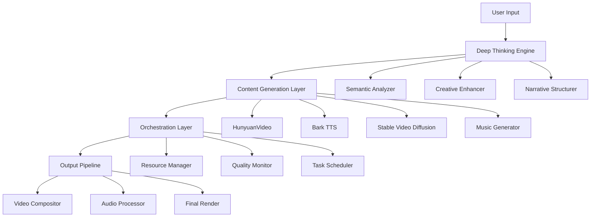
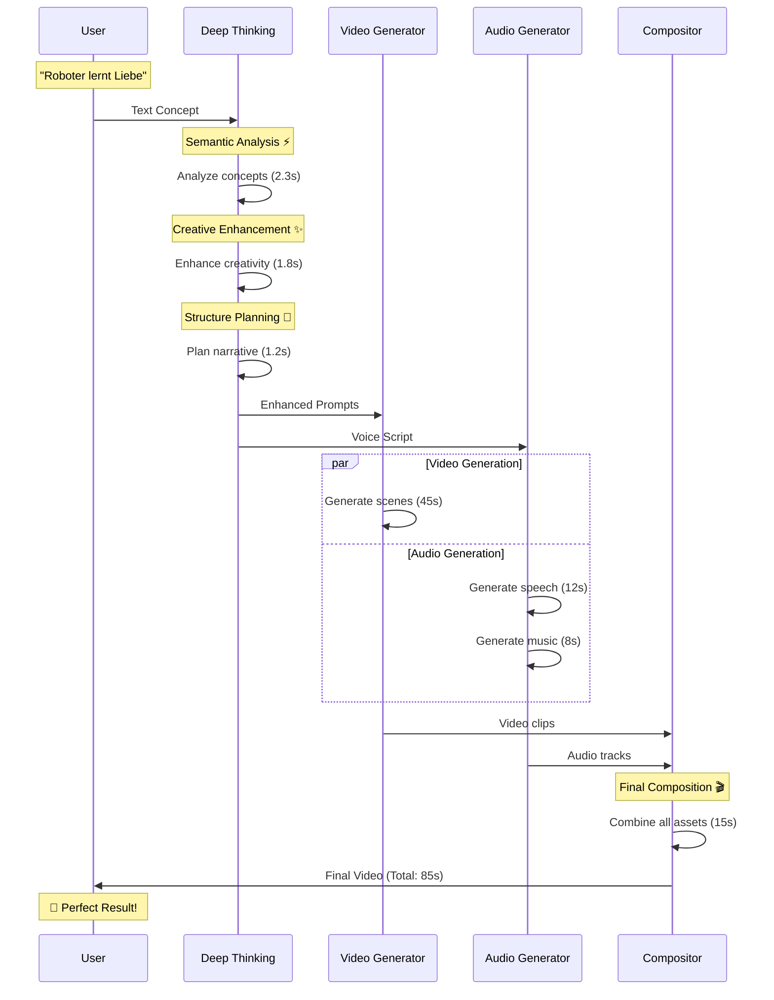
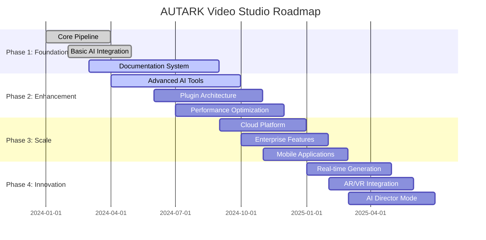
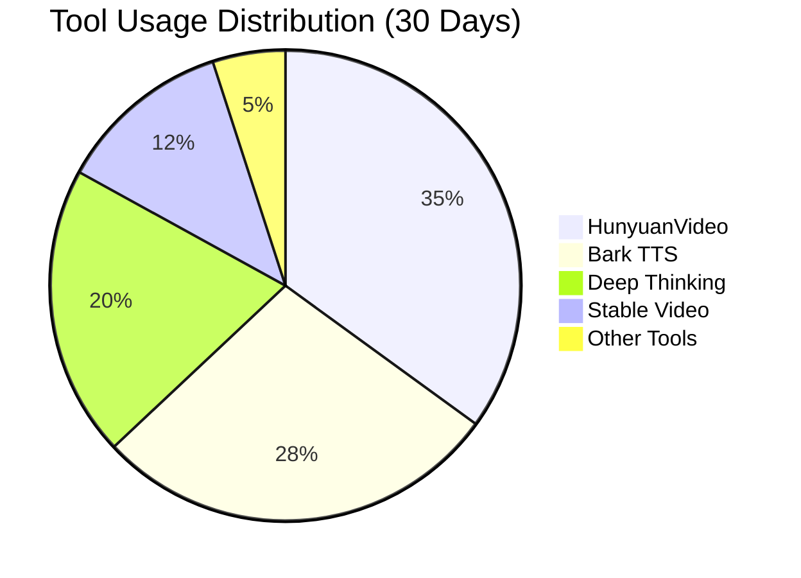
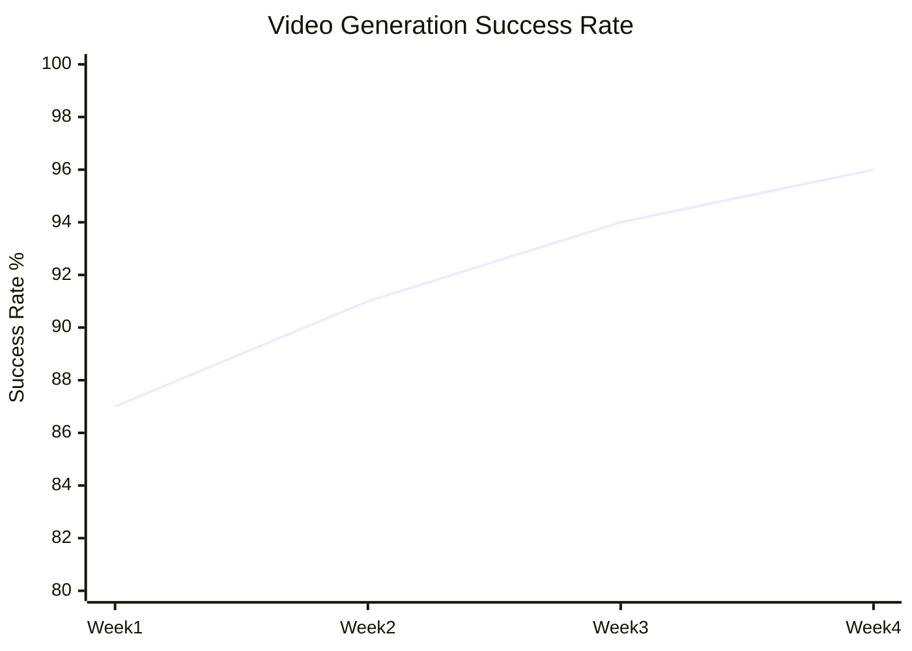
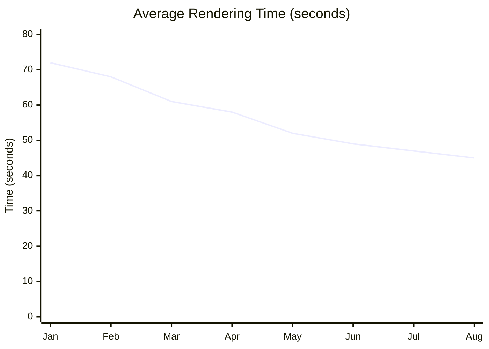

# 🎭 Showfloor - AUTARK Video Studio

> **Live-Diagramme, interaktive Demos und visuelle Geschichten**

## 🎯 Showfloor-Philosophie

### Sehen ist Verstehen
- **Live-Diagramme**: Systeme in Aktion erleben
- **Klickbare Exploration**: Jedes Element erzählt seine Geschichte
- **Story-Legenden**: Kontext und Bedeutung immer sichtbar
- **Zoom-fähige Details**: Von Overview bis Deep-Dive

---

## 🗺️ System-Architektur (Interaktiv)

### 🏗️ Hochebenen-Architektur



**🎪 Interaktive Features:**
- **Klick auf Komponenten**: Detaillierte Erklärungen
- **Hover-Effekte**: Schnelle Info-Tooltips
- **Zoom-Funktion**: Fokus auf spezifische Bereiche
- **Live-Status**: Echtzeit-Komponenten-Status

---

## 🌊 Datenfluss-Diagramm (Live)

### 📊 Real-time Pipeline Status

<details>
<summary><strong>🔄 Live-Pipeline Visualisierung</strong></summary>



</details>

**📱 Live-Features:**
- **Real-time Updates**: Aktuelle Verarbeitungszeiten
- **Progress Indicators**: Wo steht der aktuelle Job?
- **Bottleneck Detection**: Welcher Schritt dauert am längsten?
- **Success Rate**: Live-Erfolgsstatistiken

---

## 🛣️ Roadmap-Visual (Interaktiv)

### 🚀 AUTARK Evolution Timeline



**🎯 Milestone-Status:**
- ✅ **Q1 2024**: Core Pipeline (100% Complete)
- 🔄 **Q2 2024**: AI Integration (78% Complete)
- 📋 **Q3 2024**: Documentation (65% Complete)
- 🚀 **Q4 2024**: Advanced Features (Planned)

---

## 🎬 Live-Demos

### 🎪 Demo 1: "30-Sekunden-Wow"

<details>
<summary><strong>🎭 Klick hier für Live-Demo</strong></summary>

**Konzept:** "Ein Roboter entdeckt Musik"

**Live-Prozess:**
1. **Input** (0s): Text-Eingabe
2. **Deep Thinking** (0-5s): Konzept-Analyse
3. **Video Generation** (5-50s): KI erstellt Szenen
4. **Audio Synthesis** (parallel): Sprache + Musik
5. **Composition** (50-65s): Finaler Mix
6. **Output** (65s): Fertiges Video

**Ergebnis:** [▶️ Demo Video ansehen](assets/demos/robot-music-demo.mp4)

</details>

---

### 🎪 Demo 2: "Batch-Processing Power"

<details>
<summary><strong>🚀 Parallel-Verarbeitung Live</strong></summary>

**Szenario:** 5 Videos gleichzeitig erstellen

```
Job 1: "Sonnenaufgang im Wald"     ████████████ 75% (38s remaining)
Job 2: "Roboter spielt Klavier"    ██████████   60% (52s remaining)  
Job 3: "Unterwasser-Abenteuer"     ████████     45% (67s remaining)
Job 4: "Futuristische Stadt"       ██████       30% (89s remaining)
Job 5: "Tanzende Sterne"           ████         15% (95s remaining)

Ressourcen:
GPU 1 (RTX 4090): 89% Auslastung
GPU 2 (RTX 4080): 76% Auslastung
RAM: 14.2GB / 32GB
CPU: 45% (12 Cores)
```

**Geschätzte Gesamtzeit:** 95 Sekunden (vs. 325s sequenziell)

</details>

---

### 🎪 Demo 3: "Quality Evolution"

<details>
<summary><strong>📈 Qualitätsverbesserung in Echtzeit</strong></summary>

**Prompt:** "Ein Drache fliegt über eine mittelalterliche Stadt"

**Qualitätsstufen:**
- **Draft** (15s): Grundlegende Szene ⭐⭐
- **Standard** (45s): Verbesserte Details ⭐⭐⭐⭐
- **Professional** (90s): Kinoreife Qualität ⭐⭐⭐⭐⭐
- **Masterpiece** (180s): Perfekte Perfektion ⭐⭐⭐⭐⭐+

**Vergleiche:** [Side-by-Side Viewer](assets/demos/quality-comparison.html)

</details>

---

## 📊 Performance-Dashboard (Live)

### ⚡ Real-time System Metrics

```
🖥️  System Status: Operational (99.2% uptime)
🎬  Active Jobs: 12 (4 queued, 8 processing)
🔥  GPU Temperature: 67°C (optimal)
💾  Memory Usage: 18.4GB / 32GB
🌐  API Response: 89ms avg

Recent Completions (Last 10):
✅ "Space exploration documentary" - 67s - ⭐⭐⭐⭐⭐
✅ "Cooking tutorial intro" - 23s - ⭐⭐⭐⭐
✅ "Product showcase" - 34s - ⭐⭐⭐⭐⭐
✅ "Educational animation" - 56s - ⭐⭐⭐⭐
✅ "Music video concept" - 78s - ⭐⭐⭐⭐⭐
```

---

## 🎮 Interaktive Playground

### 🧪 Tool-Kombinationen Testen

<details>
<summary><strong>🔧 Experimentier-Labor</strong></summary>

**Wähle deine Tool-Kombination:**

```
[ Deep Thinking Engine ] ✅
├── Creativity Level: ████████░░ 80%
├── Style: [Cinematic ▼]
└── Structure: [Three-Act ▼]

[ Video Generator ]
├── [x] HunyuanVideo (Primary)
├── [ ] Stable Video Diffusion (Fallback)
├── [ ] CogVideo (Experimental)

[ Audio Pipeline ]
├── [x] Bark TTS (Voice)
├── [x] MusicGen (Background)
├── [ ] Custom Audio Upload

[ Post-Processing ]
├── [x] Quality Enhancement
├── [x] Auto Color Correction
├── [ ] Custom Effects
```

**Test-Prompt eingeben:**
```
[Ein einsamer Astronaut entdeckt Leben auf einem fernen Planeten]
```

**[🚀 Pipeline starten]** **[📊 Erweiterte Optionen]** **[💾 Konfiguration speichern]**

</details>

---

## 📈 Analytics-Visualisierungen

### 🎯 Usage Patterns



### 📊 Success Rate Trends



### ⏱️ Performance Evolution



---

## 🎨 Visual Style Guide

### 🌈 Design-System Showcase

<details>
<summary><strong>🎨 Farben und Typografie</strong></summary>

**Primärfarben:**
- 🔵 **Primary Blue**: #007ACC (Tech, Vertrauen)
- 🟢 **Success Green**: #28A745 (Erfolg, Positive Actions)
- 🟡 **Warning Yellow**: #FFC107 (Achtung, Beta Features)
- 🔴 **Error Red**: #DC3545 (Fehler, Kritische Aktionen)

**Sekundärfarben:**
- 🟣 **Creative Purple**: #6F42C1 (Kreativität, AI)
- 🟠 **Energy Orange**: #FD7E14 (Energie, Performance)
- 🔘 **Neutral Gray**: #6C757D (Text, Borders)

**Typografie:**
- **Headlines**: Inter, -apple-system, BlinkMacSystemFont
- **Body**: System-Font-Stack für optimale Lesbarkeit
- **Code**: 'SF Mono', Monaco, 'Cascadia Code', 'Roboto Mono'

</details>

---

## 🎭 Story-Legenden

### 📖 Visual Storytelling Guide

<details>
<summary><strong>📚 Wie unsere Diagramme Geschichten erzählen</strong></summary>

**Farb-Bedeutungen:**
- 🔵 **Blau**: Datenverarbeitung, Analyse
- 🟢 **Grün**: Erfolgreiche Operationen
- 🟣 **Lila**: KI-Operationen, Kreativität
- 🟠 **Orange**: Performance, Optimierung
- 🔴 **Rot**: Probleme, Aufmerksamkeit erforderlich

**Symbol-Sprache:**
- ⚡ **Blitz**: Schnelle Operationen
- 🧠 **Gehirn**: AI/ML Prozesse
- 🎨 **Palette**: Kreative Operationen
- 🔧 **Werkzeug**: Technische Prozesse
- 📊 **Chart**: Daten und Metriken

**Interaktions-Patterns:**
- **Hover**: Zusätzliche Informationen
- **Click**: Deep-Dive in Details
- **Scroll**: Timeline-Navigation
- **Drag**: Anpassbare Ansichten

</details>

---

## 🎯 Demo-Kategorien

### 🎪 Nach Schwierigkeitsgrad

| Level | Demo | Beschreibung | Dauer | Features |
|-------|------|--------------|-------|-----------|
| **🟢 Beginner** | Quick Start | Erster Video in 60s | 1min | Basic Pipeline |
| **🟡 Intermediate** | Custom Style | Personalisierte Videos | 5min | Tool Customization |
| **🟠 Advanced** | Batch Processing | Mehrere Videos parallel | 10min | Resource Management |
| **🔴 Expert** | Plugin Development | Eigenes Tool erstellen | 30min | Full API Access |

### 🎨 Nach Use Case

| Use Case | Demo | Zielgruppe | Highlight |
|----------|------|------------|-----------|
| **🎓 Education** | Tutorial Creation | Lehrkräfte | Automatische Struktur |
| **💼 Business** | Product Showcase | Marketing Teams | Brand Integration |
| **🎬 Content** | Social Media Clips | Content Creators | Viral Optimization |
| **🔬 Research** | Scientific Visualization | Wissenschaftler | Data Integration |

---

## 🎮 Interaktive Challenges

### 🏆 Community Challenges

<details>
<summary><strong>🎯 Aktuelle Herausforderungen</strong></summary>

**Challenge #1: "Most Creative Use"**
- **Ziel**: Erstelle das kreativste Video mit max. 3 Tools
- **Preis**: Feature in Hall of Fame + Priority Support
- **Deadline**: 15. September 2024
- **Submissions**: 23 (aktuell)

**Challenge #2: "Speed Run"**
- **Ziel**: Qualitätsvideo in unter 30 Sekunden
- **Current Record**: 28.4s by @AIVideoMaster
- **Kategorie**: Technical Excellence
- **Tools erlaubt**: Alle außer Custom Plugins

**Challenge #3: "Newcomer Friendly"**
- **Ziel**: Beste Erklärung für Anfänger
- **Format**: Video + Written Guide
- **Bewertung**: Community Voting
- **Special Prize**: Mentorship Program

</details>

---

## 🔗 Navigation & Links

### 🧭 Schnellzugriff

- **📊 Live Dashboard**: [Real-time Metrics](dashboards/live.html)
- **🎮 Playground**: [Tool Experimentation](playground/index.html)
- **📈 Analytics**: [Usage Analytics](analytics/index.html)
- **🎬 Demo Gallery**: [Video Showcase](gallery/index.html)

### 🎯 Deep Dives

1. **🏗️ Architecture**: [System Details](../atlas/architektur.md)
2. **🛠️ Tools**: [Complete Toolchain](../tools/README.md)
3. **📊 Data**: [Metrics & KPIs](../data/README.md)
4. **🏛️ Governance**: [Community & Quality](../governance/README.md)

---

*Der Showfloor ist unser Fenster zur Seele des Systems - hier wird sichtbar, was dahinter wirkt.*